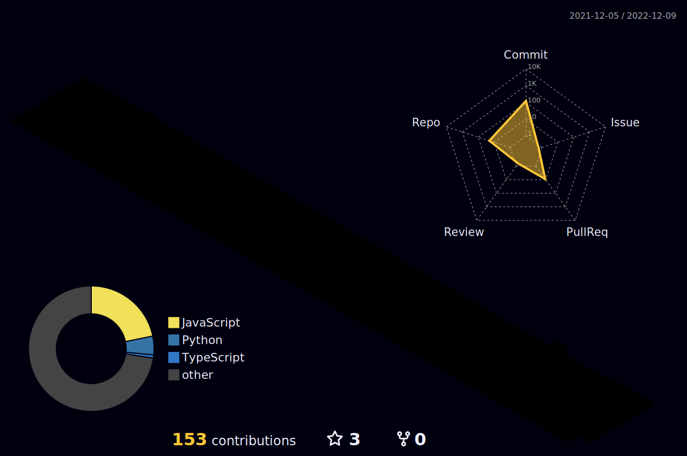

 

    <h1> Hi there, I'm Samuel Zega🚀<a href="#"></h1>
  

  

 
 

### I'm a Software Engineer!

- 🔭 I’m currently working as Senior Backend Engineer at [OCBC](https://www.ocbc.com/).
- 🌱 I’m currently expanding my knowledge in MERN Stack.
- 👯 I’m looking to collaborate with developers.
- 💬 Ask me about Android Development or any tech related stuff.
- 🥅 2022-23 Goals: Contribute more to Open Source projects.
- 💬 Ask me about Android Development or any tech related stuff.
- 😄 Pronouns: He
- ⚡ Fun fact: I love watching anime.
- 💎 If you are a Tech person let's get [connected](https://www.linkedin.com/in/samuelzega/).

## 🤝🏻 &nbsp;Reach Out To  Me

<!--  -->

 <h2>Tech Stack</h2>

<table width="80%">
<tr>
	<td align='center' width="200">
        
    </td>
        <td align='center' width="200">
        
    </td>
    

 <td align='center' width="150">
        
    </td>
 <td align='center' width="200">
        
    </td>
 <td align='center' width="200">
        
    </td>
 
</tr>
 
<tr>
    <td align='center' width="200">
        
    </td>
    <td align='center' width="200">
        
    </td>
 <td align='center' width="200">
        
    </td>
	 <td align='center' width="200">
        
    </td>
	</td>
	 <td align='center' width="200">
        
    </td>

</tr>
 
<tr>
    <td align='center' width="200">
        
    </td>
    <td align='center' width="200">
        
    </td>
 <td align='center' width="200">
        
    </td>
  <td align='center' width="200">
        
    </td>
    <td align='center' width="200">
        
    </td>
</tr>
	
<tr>
    <td align='center' width="200">
        
    </td>
    <td align='center' width="200">
        
    </td>
 <td align='center' width="200">
        
    </td>
     <td align='center' width="200">
        
    </td>
    <td align='center' width="200">
        
    </td>
</tr>
    
</table>

## Holopin Board
	

|Stats />|Streak />|Languages />
|---|---|---|
||||

## ⚡️Github Contributions
	
<h4 align="center">Isometric view of contributions in the last year</h4>

	

## 🚀Github Metrics

	will update soon

	
## 🐛Github Magic Game

  

 

 
  Views 
  

